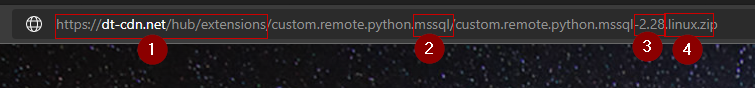

# Chef Cookbook Activegate Extensions

Chef cookbook to manage ActiveGate extensions 1.0 - Install & Update

## Usage:

Modify `attributes/default.rb` with values according to your environment.

Provide API_TOKEN value as `default['dynatrace']['api_token']` adhering to your organization's standards (Value not shown set in cookbook).

<br/>

## Specifying extensions to Install/Update

Add/Modify below entries in `attributes/default.rb`

```
default['extensions'] = {
    'ibmmq_java' => { 
        'version' => '2.020.10',
        'os' => ''
    },
    'mssql' => {
        'version' => '2.28',
        'os' => '.linux'
    },
    'db2'   => {
        'version' => '1.2.23',
        'os' => '.linux'
    },
    'datapowerxml'   => {
        'version' => '1.107',
        'os' => ''
    }
}
```

Get above details for extensions from [Dynatrace Hub](https://www.dynatrace.com/hub/).

Example:

1. Copy Extension download link from [Dynatrace Hub](https://www.dynatrace.com/hub/)

   

2. Extract values from the download link

   

   `https://dt-cdn.net/hub/extensions/custom.remote.python.mssql/custom.remote.python.mssql-2.28.linux.zip`

   1. `extension_repo` : `https://dt-cdn.net/hub/extensions`
   
   2. `name`           : `mssql`

   3. `version`        : `2.28`

   4. `os`             : `.linux` (Include `.` before os name, if os name is present in download link)


